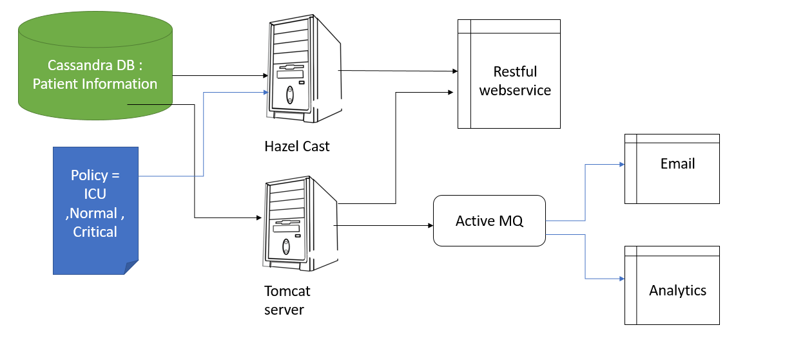
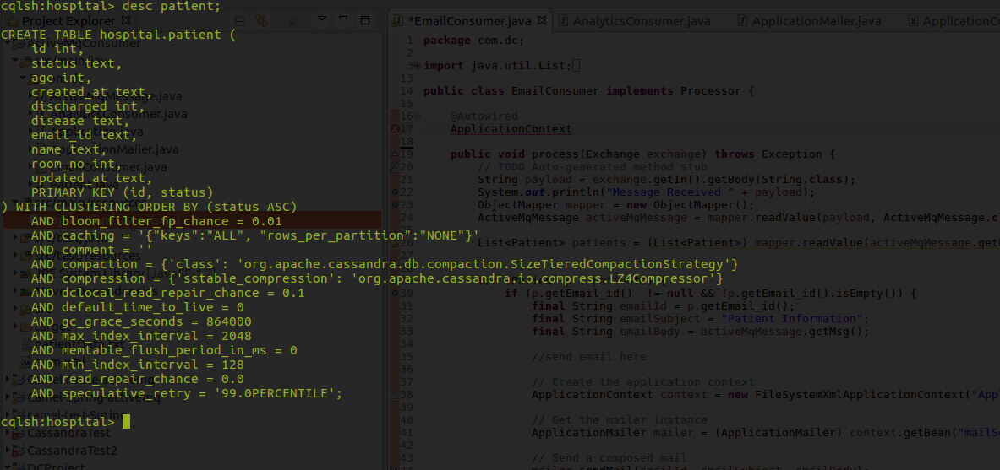

# Distributed_Hospital_design

</h1>About Project</h1>
This project contains 3 modules that simulate an hospital design. The three components contains  
<b>1) Policy Server:</b> The policy server contains the policy based on which the Hazelcast distributed cache is updated. It exposes two RESTful API's to update and get the policy from the policy server. 
<b>2) The Main Server:</b> The main server is integrated with <i>Cassandra Database</i> which stores the patient table (in hospital keyspace). It also contains a Hazelcast cache which stores the patient records based on the status(policy) obtained from the policy server. Then finally this server exposes the API's to delete, create, get and delete records. 
<b>3) The Activemq Consumer:</b> This server consumes the postprocessing messages written on the queues of Activemq by the main server. Based on the queue it either writes everything in the log or send an email to the patient about its status.  

This repository contains all the files required to change the HappyPatients hospital from a monolith to an easy to understand and operate microservices architecture.  

<h1>Requirements </h1>
1 Java 1.8 
2 Cassandra 2.x  
3 ActiveMq  
4 HazelCast  

The different components used in this project include  

1. RESTful web service  
2. Cassandra database  
3. Hazelcast cache  
4. Messaging with Active MQ  
5. Apache Camel  
6. Java SPRING  
7. Spring Datastax cassandra for ORM model 
8. Tomcat Server 

The redesign of the HappyPatients hospital has the following architecture:  

Some things to note before running the application is that the cassandra version used for this project is 2.2 and using the 3.x release might lead to unexpected behavior.  

The main folder containing all the java packages to run a RESTful webservice connected to the cassandra database can be found inside DC Project 
All dependencies needed to run the RESTful webservice are speecified inside POM.xml of DC Project folder. 
The RESTful webservice is built using SPRING and the database is connected using Spring-data-cassandra. 

To execute this part of the project run perform <i>maven clean install</i> and copy the war file in the webapps folder of tomcat server. Make RESTful API calls using postman 

To execute the policy server run the file PolicyController.java inside PolicyServer-->src-->main-->java-->com-->java-->controller  

Both files from DC Project and Policy server must be run concurrently.  
In order to execute the applications on the server , perform a ,maven build over the project.  
WAR files are not included in the repository because of their large size(>50MB), hence it is imperative to build project using maven.   

Below is the schema used for cassandra database   
keyspace name = hospital 
table name = patient 

The folder :ActiveMQConsumer contains all java files to perform 2 actions : Send Email and Analytics. 
Every time an action is performed on the database a message is sent to the 2 queues and corresponding actions are performed. 
The main class for this is called Application.java. 

Feel free to contact me for any further clarifications.

